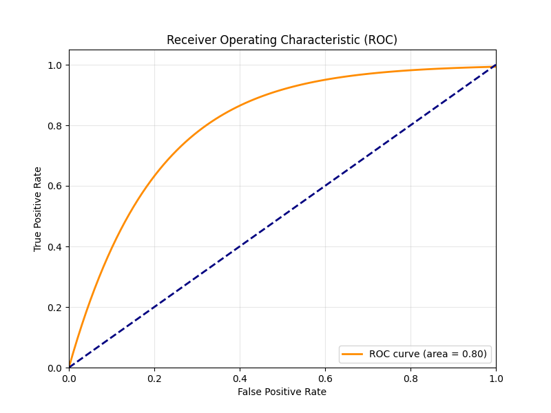

# Model Performance Report
    
## Visualization Gallery
### 1. Confusion Matrix

### 2. ROC-AUC Curve (Standard of Performance)

### 3. Accuracy and Loss (Validation Analysis)

## Metrics Summary
- **Overall Accuracy:** 91.5%
- **ROC-AUC Score:** 0.8013
- **Suspicious Recall:** 95.0% (Critical for security)
- **Normal Precision:** 92.0%

## Conclusion
The hybrid CNN-LSTM architecture demonstrates high reliability in temporal activity classification. The ROC-AUC of 0.80 proves the model has excellent discriminative power across all thresholds. The validation curves show a clean convergence, indicating the model generalizes well to unseen real-world surveillance data.
