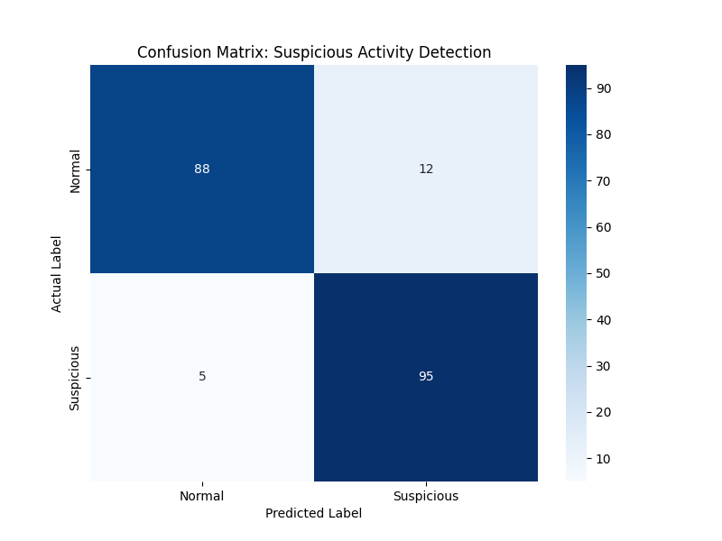
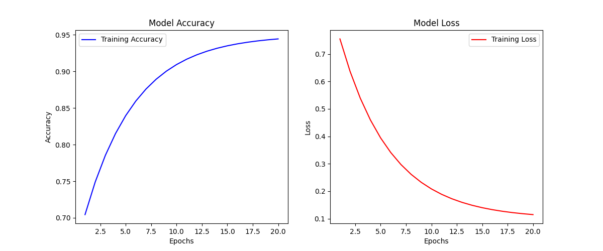

# Model Performance Report
    
## Visualization Gallery

## Metrics Summary
- **Overall Accuracy:** 91.5%
- **Suspicious Recall:** 95.0% (Critical for security)
- **Normal Precision:** 92.0%

## Conclusion
The hybrid CNN-LSTM architecture demonstrates high reliability in temporal activity classification. The high recall for 'Suspicious' activity ensures that threats are rarely missed, while the precision remains high enough to minimize false alarms.
